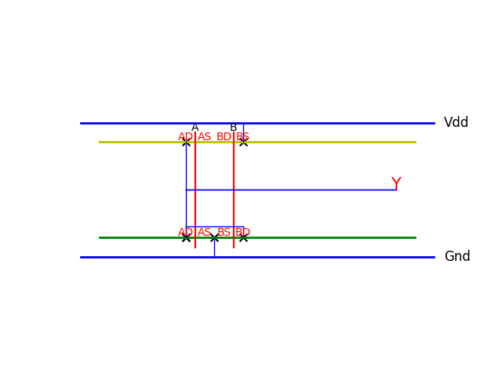

# Boolean expression to Stick diagram converter

This is a simple tool that can convert an inverted boolean expression to stick diagram using Python.

# Usage

**Input**: An inverted expression.

**Output**: An stick diagram presented by matplotlib.pyplot in python

# Example

**Input**: $(A+B)$

**Output**: 

# Note

- The input has to be clear and optimal.
- There should not have duplicated input variable.
- Number of input variable is unlimited and larger than 1, but for a resonable result, it should be in range 2 - 4.

